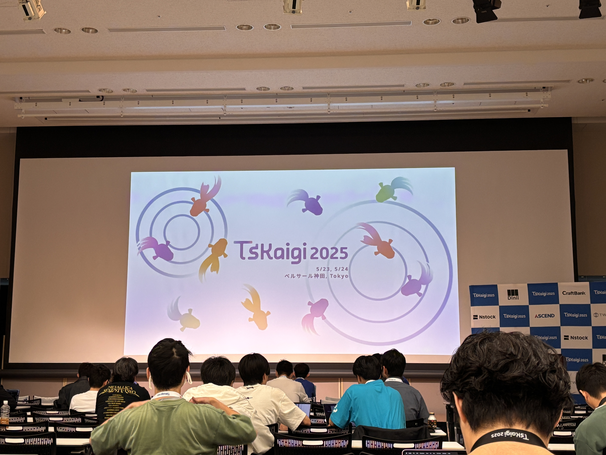

# TSKaigi 2025 に参加しました！（学生支援・参加レポート）

## まえがき
本記事は 2025/05/23 ~ 2025/05/24 に開催された [TSKaigi 2025](https://2025.tskaigi.org/) の参加レポートです。
今回は、学生支援制度で参加させていただきました。交通費の支援をしていただき、非常に貴重な機会をいただけました。

### TSKaigi とは
プログラミング言語 TypeScript をテーマとした技術カンファレンスで、名前にTypeScriptが含まれるカンファレンスの中では世界最大の規模だそうです。

今回のテーマは「学び、繋がり、”型”を破ろう」です。

## 本編
分量が多くなってしまうため、気になったトピックや面白かった発表について紹介させていただきます。ご承知おきください。

### Day 1
新幹線で東京へ向かいます。
新幹線の中でタイムテーブルを確認して、スケジュールを立てました。

実際のスケジュール表

こっちは新幹線からの車窓

そんなこんなで、会場着。中に入ります（外の写真を撮るのを忘れてしまった）

スタンプラリーとガイドブック、TSKaigiのノベルティを幾つかもらいました。

講演中写真を撮るか否かで迷って全然撮れていないので、ここからは文章でお楽しみください…。

#### 【招待講演】The New Powerful ESLint Config with Type Safety
Anthony Fu（[@antfujp](https://x.com/antfujp)） さんによる講演です。

[講演資料](https://talks.antfu.me/2025/tskaigi/1)

自己紹介でびっくり仰天！

何やら、Vite や Vue、Nuxt のコアチームメンバーとのこと！
そのほかにも、Vitest やSlidev、Type Challenges…などなどを作っていらっしゃるとか……！

内容は、Flat Config とそれに関連するプラグインの紹介でした。

Flat Config は ESLint v9.0.0 でリリースされた機能で、ESLintの設定ファイルに関するもののようです。

Flat Config と対比して Legacy Config があります。これは、よく見かける `.eslintrc.json` のことです。

一方で、Flat Config は、`eslint.config.js` のようです。

`.js（.mjs, .cjs, .ts）` で設定ファイルを書けるようになりました。

<small>そういえば最近 TypeScript のプロジェクトセットアップで `.eslintrc.json` じゃなくて `eslint.config.js` を使えって怒られていた気がします。</small>

Legacy Config から Flat Config にマイグレーションしてくれる @eslint/migrate-config があるようです。

そのほかにも、Config Inspector（Official）や Flat Config Utils（Community、アンソニさん作成）の [eslint-flat-config-utils](https://github.com/antfu/eslint-flat-config-utils)、 [eslint-typegen](https://github.com/antfu/eslint-typegen)、 [eslint-plugin-command](https://github.com/antfu/eslint-plugin-command)　などなど様々なものが紹介されていました！

特に、`eslint-plugin-command` は魔法みたいで驚きました。すごい。

[antfu/eslint-config](https://github.com/antfu/eslint-config)

#### ランチ

ランチは会場でお弁当をいただきました。いくつか種類があったのですが、自分は大きなサイズの弁当を選びました。

中を開けると…！

なかなか豪華…！
おいしかった。

#### TypeScriptで実践するクリーンアーキテクチャ ― WebからもCLIからも使えるアプリ設計

プログラミングをするパンダ（[@Panda_Program](https://x.com/panda_program)） さんによる講演です。

[講演資料](https://speakerdeck.com/panda_program/clean-architecture-with-typescript-application)

[Zennの記事](https://zenn.dev/panda_program/articles/clean-architecture-application)

写真撮影させていただきました。

クリーンアーキテクチャとは何か？と言われると同心円がついつい出てきがち（なイメージ）ですが、実はそうではなくて、「ポリモーフィズムによって、すべてのソースコードの依存関係を絶対的に制御する能力」（by ボブおじさん）とのこと。

たしかに自分もクリーンアーキテクチャは同心円が先に出てきましたが、これを聞いて腑に落ちました。なるほど。

実際にやってみたパートでは、具体的なソースコードを用いて解説されておりました。

ちょっとこのあたりはまだ理解できていない部分もあるので、講演資料やZennの記事を参照していただけると良いかと思います。
（自分も見直して理解するぞ…！）

そして、付録のボブおじさんのくだりも面白かったです。

本セッションを聴いて、クリーンアーキテクチャの本質としては、SOLID 原則と理解しました。
クリーンアーキテクチャの本読みます…！

#### 【LT】転生したらTypeScriptのEnumだった件～型安全性とエコシステムの変化で挫けそうになっているんだが～

やまのく（[@yamanoku](https://x.com/yamanoku)） さんによるLTです。

[講演資料](https://yamanoku.net/tskaigi-2025/)

これは自分が紹介するよりも、講演資料を見ていただいたほうが面白いかなと！

会場は大爆笑の渦に包まれていました。自分もずっとツボに入っていました笑

自分もこういうセンス、欲しい（切実）

#### スタンプラリー
スポンサースタンプラリーを終わらせました。

様々なスポンサー企業様とお話ができて非常に有意義でした。
たくさんノベルティもいただき、ありがとうございました。

スタンプラリーの景品は… TSKaigi の缶バッチ２ついただきました。

スポンサー企業様

いただいたノベルティなど。

タンブラーやタオル、アイスクリーム用スプーンなど、日常利用に嬉しいものがいっぱい…！

#### ~ Day 1 の終わり~
夜は東京駅のカレーを食べました。

そのあと、新宿の方に宿をとっていたので新宿のほうへ。
新宿のラーメン屋さんでまた少し食べました。

別に食いしん坊じゃないです。

### Day 2

続いて２日目です。

Day 2 はちゃんと写真を撮りました。

#### 【主催者講演】TypeScriptネイティブ移植観察レポート TSKaigi 2025
berlysia（[@berlysia](https://x.com/berlysia)） さんによる主催者講演です。

[講演資料](https://speakerdeck.com/berlysia/typescript-native-porting-observation-tskaigi-2025)

TypeScript の実装（Strada：既存のTypeScript実装）と10倍早い TypeScript（Corsa：新しいGo言語による実装）について詳しく説明されていました。

3/11に、「A 10x Faster TypeScript」のタイトルで激アツなお知らせがあったらしいのですが、なんと、TSKaigi 1日目と時を同じくして TypeScript Native Preview が上がったとのこと…！！
すごいタイミング…！

今回 TypeScript Compiler が 10倍早くなるとのこと。え？10倍？

ネイティブ移植する理由として、「既にJavaScript実装での限界に達している」ということでした。たしかに、そうだよね…。

JavaScript実装の限界を超える手段として、Go言語への「移植」が行われると。

なぜ「移植」が選ばれたか、というと、後方互換性とプラグアンドプレイで置き換えられるものを目指すためのようです。

ではなぜGo言語なのか？というと、いろいろな条件をすべてバランスよく満たすのがGoだったためらしい。

ネイティブ化（3x~3.5x）× 並列処理（3x~3.5x）= _10x Faster_
ということらしい。

スピード感がすごい、ということはよくわかりました。

#### 【学生支援】スカラシップランチ

学生向けのプログラムとして学生と支援企業が参加するスカラシップランチが開催されました。

これは、TSKaigiの会場ではなく別の会場にて行われました。

ここでは、[支援企業様](#tskaigi-2025-学生支援企業様) と 学生支援で参加した学生同士が交流するイベントとなっていました。（ここでの写真が一切ないことに執筆中に気付く…反省）

いくつかのグループに分かれ、お弁当を食べながら自己紹介や普段TypeScriptを書いているかなどの話題で盛り上がりました。

自分の大学では、同じ学生同士でなかなか語り合える人がいなかったので、すごく刺激的でした。

みんな個人開発していたり、インターンに参加していたりえらい…。

少し時間が経ってグループのメンバーをチェンジして、[株式会社ドワンゴ](https://dwango.co.jp/)の社員さんとお話させていただきました。

プロジェクトはどのような開発体制なのか？ということやレガシーコードはあるのか？などいろいろお聞きしました。

公開して良いのかわからないので具体的な内容は伏せますが、実際に働いている方のマインド(?)を聴けて良かったです。

また、学生同士で SNS の交換も行って、新しい繋がりも増えました！

#### "良い"TSのコードを書く為のマインドセット
Kei（[@kei_english_ca](https://x.com/kei_english_ca)） さんによる講演です。

[講演資料](https://speakerdeck.com/kei95/liang-i-typescriptwoshu-kutamenomaindosetuto)

TypeScript は構造的型システムを採用した半静的言語で、なぜ構造的型システムなのかというと動的言語である Java
Script との親和性を高めるためらしい。ﾁｮｯﾄｷｲﾀｺﾄｱﾙ

優秀なTSエンジニアの共通するマインドセットとしては、Soundness（健全性）とUsability（実用性）のトレードオフを"意識的"に行うこととのこと。

コードの中での健全性は"実行時とコンパイル前は同じ型である"と定義されていました。

実用性重視のコードは型定義を最小にして実行を優先します。

健全性重視のコードは型定義やエラーハンドリングを駆使して安全な実行を優先します。

ソフトウェア開発においてトレードオフはどの段階でも起こるので、場面や状況によって、健全性を重視するのか実用性を重視するのか意識して設計できるようになりたいですね…。

#### 【LT】TypeScriptのmoduleオプションを改めて整理する
おおいし（[@bicstone_me](https://x.com/bicstone_me)） さんによるLTです。

[講演資料](https://speakerdeck.com/bicstone/typescript-module-option)

写真を撮らせていただきました。

普段何気なく使っている tsconfig ですが、その中の `compilerOptions` のひとつ、 `module` についての内容でした。

オプションの種類は何があるか？オプションで何が変わるか？がわかりやすくまとめられていました。

自分は結構プロジェクトのセットアップはChatGPTに投げがちだったのですが、これを聴いてちゃんと自分で理解して設定しよう…と思いました。

それにしてもオプションが多すぎてあまりにわからなさすぎる…

#### 懇親会

懇親会もなんと写真を撮り忘れていました……　普段写真を撮る機会が少ないばかりに…　反省です。

懇親会でも、いろいろな方とお話させていただきました。

話した皆さんは社会人の方で、学生の自分には到底ついてけない話ばかりでしたが、自分の知らないところでもつよつよエンジニアはたくさんいる、と気付きモチベがとても上がりました。

お寿司の実演提供や豪華なビュッフェ(?)があり、たくさんいただきました。
とてもおいしかった…。

<blockquote class="twitter-tweet">
【<a href="https://twitter.com/hashtag/TSKaigi2025?src=hash&amp;ref_src=twsrc%5Etfw">#TSKaigi2025</a> 終了しました】  🎊無事すべてのコンテンツが終了いたしました🎊 様々な形で多くの方にご参加いただきました❗️ ありがとうございました‼️<a href="https://twitter.com/hashtag/TSKaigi?src=hash&amp;ref_src=twsrc%5Etfw">#TSKaigi</a> <a href="https://t.co/wEjCS7rhky">pic.twitter.com/wEjCS7rhky</a>
&mdash; TSKaigi (@tskaigi) <a href="https://twitter.com/tskaigi/status/1926234689682939990?ref_src=twsrc%5Etfw">May 24, 2025</a></blockquote> 

## 感想
初めての技術カンファレンスだったので、正直不安がいっぱいありました。

しかし、参加している方全員TypeScriptに興味がある、という点で非常に心強かったです。

自分はまだまだひよっこなので、難しい講演もありましたが、TypeScriptの最新動向や様々な価値観、マインドセットなどを聴いて学ぶことができ、非常に有意義だと感じました。

アウトプットが苦手で、うまく伝えられているかどうかがいささか心配ではあるのですが、皆さんの興味のきっかけになりましたら幸いです。

また、学生でも学生支援制度などがあり（抽選ですが）参加の敷居は低いのかなと思いました。

今回TSKaigi に参加して、まずは興味を大事にして新しいことに触れ続けていきたいと改めて認識しました。

そして、普段写真を撮らなさすぎて全然写真を撮れていないことは反省です…

## むすび
運営ボランティアの皆様、スポンサー企業さま、個人スポンサーの皆様、運営お疲れさまでした。

非常に良い機会でした。貴重な機会をありがとうございました！

## 【TSKaigi 2025 学生支援企業】様
* [株式会社TOKIUM](https://corp.tokium.jp/)
* [株式会社ドワンゴ](https://dwango.co.jp/)
* [トグルホールディングス株式会社](https://toggle.co.jp/)
* [レバレジーズ株式会社](https://leverages.jp/)
* [株式会社TwoGate](https://twogate.com/)

改めて、学生支援企業様、今回このような機会を設けてくださり、ありがとうございました！！
